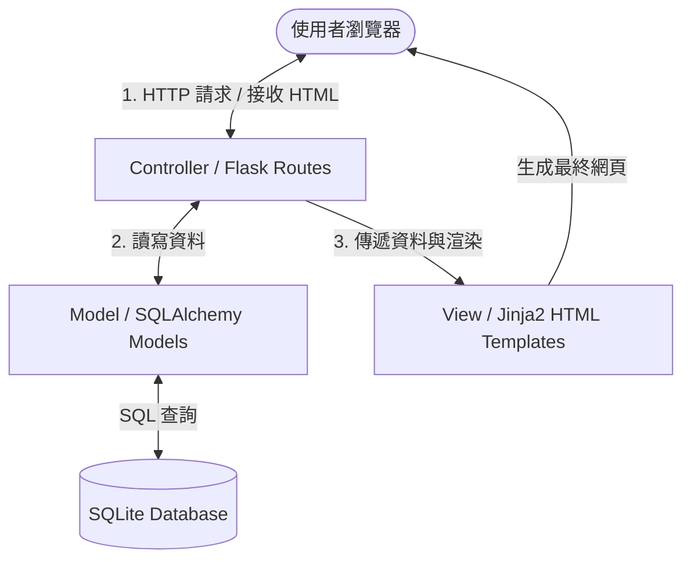
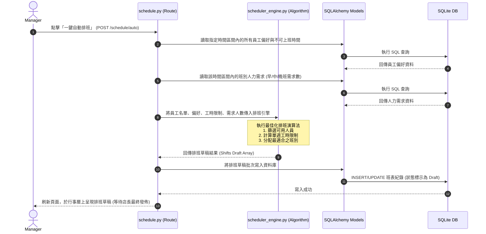

# 自動打工排班最佳化系統 — 系統架構設計模板 (ARCHITECTURE)

本模板依據產品需求模板（PRD）所定義之功能範圍，規劃本系統之技術架構、專案資料夾結構、元件交互關係與關鍵技術決策，作為系統實作與資料庫設計的指導方針。

---

## 1. 技術架構說明

本系統採單體式架構（Monolithic Architecture），頁面渲染採用伺服器端渲染（Server-Side Rendering, SSR）模式，不進行前後端分離，以求在輕量化開發的同時，兼顧系統的流暢度與維護性。

### 1.1 選用技術與原因
- **後端框架：Python + Flask**
  - **原因**：Flask 是輕量且具備高度彈性的 Micro-framework，沒有臃腫的預設套件，非常適合用於中小型商家的排班系統。Python 的生態系具備強大的演算法庫與資料處理能力，有利於實作排班最佳化演算法（例如啟發式演算法或約束求解）。
- **模板引擎：Jinja2**
  - **原因**：作為 Flask 的預設模板引擎，Jinja2 能無縫接收後端傳入的資料並進行動態 HTML 渲染。相較於前後端分離，SSR 模式開發速度快、無跨域問題，且能直接利用伺服器端 Session 進行安全控管。
- **資料庫：SQLite + SQLAlchemy**
  - **原因**：SQLite 是一個內嵌式、零設定的輕量級關聯式資料庫，所有資料存放在單一檔案中，非常利於部署與備份。搭配 SQLAlchemy（ORM 架構）能有效防範 SQL 注入攻擊，並在未來有需要時無痛遷移至 PostgreSQL 或 MySQL。
- **前端增強：Vanilla CSS / JS + FullCalendar.js**
  - **原因**：使用原生 CSS（CSS Grid/Flexbox）與 JS 提供精美的響應式（RWD）介面與微動畫；引入 FullCalendar.js 實現拖拉式、多視角的互動日曆，提升店長手動微調班表的體驗。

### 1.2 Flask MVC 模式說明
雖然 Flask 本身沒有強制的目錄規範，但本系統將遵循經典的 **MVC (Model-View-Controller)** 模式進行模組化組織，以確保程式碼的高可讀性與擴充性：



- **Model（模型）**：負責定義資料表結構（Schema）與商務邏輯（例如計算單週累積工時、檢查請假衝突等）。在程式中對應於 `app/models/` 資料夾下的類別。
- **View（視圖）**：負責資料的呈現與前端互動。在程式中對應於 `app/templates/`（HTML）及 `app/static/`（CSS/JS）資源。
- **Controller（控制器）**：負責處理使用者的 HTTP 請求、執行身分驗證、調用 Model 進行資料庫操作、執行排班演算法，並將結果傳遞給 View 進行渲染。在程式中對應於 `app/routes/` 的路由函數。

---

## 2. 專案資料夾結構

本專案結構採用結構清晰的 Flask 應用程式工廠模式（Application Factory Pattern）組織：

```text
Work-scheduling-system/
├── 模板/                    # 設計規劃模板夾（包含 PRD 與架構設計）
│   ├── PRD.md              # 產品需求模板
│   └── ARCHITECTURE.md     # 系統架構設計模板 (本檔案)
├── app/                    # 應用程式核心目錄
│   ├── __init__.py         # 初始化 Flask 應用程式與套件 (Application Factory)
│   ├── models/             # 資料庫模型 (Model Layer)
│   │   ├── __init__.py
│   │   ├── user.py         # 員工與帳戶模型 (管理員/員工、偏好設定)
│   │   ├── shift.py        # 班表、班別與排班需求模型
│   │   └── leave.py        # 請假與代班申請模型
│   ├── routes/             # 路由與控制器 (Controller Layer)
│   │   ├── __init__.py
│   │   ├── auth.py         # 註冊、登入與權限控管路由
│   │   ├── main.py         # 首頁、儀表板看板路由
│   │   ├── schedule.py     # 排班管理、手動微調與自動排班觸發路由
│   │   ├── leave.py        # 請假申請與代班審核路由
│   │   └── api.py          # 提供給 FullCalendar 等前端非同步請求的 JSON API
│   ├── templates/          # Jinja2 HTML 模板 (View Layer)
│   │   ├── base.html       # 基礎版面模板 (包含導覽列、Sidebar 與通用 CSS/JS)
│   │   ├── auth/
│   │   │   ├── login.html  # 登入頁面
│   │   │   └── register.html # 註冊頁面
│   │   ├── main/
│   │   │   └── dashboard.html # 店長/員工儀表板 (缺工提示、請假提醒)
│   │   ├── schedule/
│   │   │   ├── view.html   # 班表行事曆檢視頁 (RWD)
│   │   │   └── manage.html # 店長排班編輯與自動排班控制台
│   │   └── leave/
│   │       ├── apply.html  # 員工請假與代班發起頁
│   │       └── review.html # 店長審核假單頁面
│   ├── static/             # 靜態資源目錄
│   │   ├── css/
│   │   │   ├── style.css   # 全域核心樣式與設計系統 (色彩、字型、排版)
│   │   │   └── calendar.css# 行事曆自訂與警示氣泡樣式
│   │   ├── js/
│   │   │   ├── main.js     # 全域通用互動 JS
│   │   │   └── calendar.js # FullCalendar 初始化與拖拉/點擊 API 串接 logic
│   │   └── images/         # 圖片與 Icon 資源
│   └── services/           # 獨立商務邏輯與核心演算法
│       ├── __init__.py
│       └── scheduler_engine.py # 自動排班最佳化核心演算法 (啟發式/貪婪演算法)
├── instance/               # 執行實例目錄 (Git 忽略，本地生成)
│   └── database.db         # SQLite 資料庫檔案
├── tests/                  # 單元測試與整合測試
│   ├── __init__.py
│   ├── test_auth.py
│   └── test_scheduler.py
├── .gitignore              # 排除敏感檔案 (如 database.db, pycache, .env)
├── config.py               # 系統環境變數與安全金鑰設定
├── requirements.txt        # 專案相依套件清單 (Flask, Flask-SQLAlchemy, bcrypt 等)
└── app.py                  # 專案啟動入口檔案 (呼叫 app Factory)
```

---

## 3. 元件關係與資料流圖

### 3.1 瀏覽器請求與資料庫查詢流 (Read/Write Flow)
當使用者登入系統並讀取/修改班表時，元件的呼叫路徑如下：

```text
+------------------+         HTTP Request (GET/POST)         +--------------------+
|                  | --------------------------------------> |                    |
|  User Browser    |                                         |    Flask Route     |
| (FullCalendar.js | <-------------------------------------- | (e.g. schedule.py) |
|   / HTML Form)   |              Rendered HTML              +--------------------+
+------------------+              (or JSON Data)                       |
       ^                                                               |
       | (AJAX Fetch API)                                              v (ORM Query)
       |                                                     +--------------------+
       +---------------------------------------------------- | SQLAlchemy Model   |
                                                             | (e.g. Shift model) |
                                                             +--------------------+
                                                                       |
                                                                       v (SQL)
                                                             +--------------------+
                                                             |  SQLite Database   |
                                                             |   (database.db)    |
                                                             +--------------------+
```

### 3.2 一鍵自動排班資料流 (Auto-Scheduling Engine Flow)
當店長點擊「自動排班」時，後端演算法引擎與資料庫之交互流程：



---

## 4. 關鍵設計決策

為了確保本系統的簡潔、安全與高運算效能，我們制定了以下五大關鍵設計決策：

### 4.1 狀態式 Session 身分驗證 (Session-based Authentication)
- **決策**：不採用複雜的 Token 驗證（如 JWT），而是採用 Flask 預設的 **Secure Cookie Session**。
- **原因**：因為本系統採用單體式 SSR 架構，Session 的實作最為單純且成熟。透過在伺服器端設定強簽章金鑰（`SECRET_KEY`），Session 資料會在瀏覽器端加密儲存，可防止竄改。角色存取控制（RBAC）僅需透過自訂的 Python 裝飾器（Decorator，如 `@login_required`、`@manager_required`）即可優雅地在路由層進行攔截。

### 4.2 基於啟發式權重分配的排班演算法 (Heuristic Weight-based Scheduling Algorithm)
- **決策**：排班引擎實作於 `scheduler_engine.py`，不使用沈重的外部數學求解器，而是自主開發一個基於**啟發式規則與權重打分**的貪婪演算法。
- **原因**：
  1. **效能要求**：30 人以內的排班，啟發式演算法可在 **1 秒內**算出結果，遠快於複雜的線性規劃求解器。
  2. **可調權重**：我們可以為不同的排班條件設定權重（例如：符合員工偏好時段加 10 分、連續上班天數過多扣 15 分），使演算法能非常人性化地逼近最佳解，且未來規則容易調整與擴充。

### 4.3 請假衝突與缺工的「動態預檢」機制 (Dynamic Pre-check Mechanism)
- **決策**：在「員工提出請假」、「店長核准請假」或「店長手動調整班表」的當下，系統不只做簡單的資料庫寫入，而是觸發一個 `pre_check_compliance()` 函數。
- **原因**：此函數能即時分析該變動是否會導致：
  - 某個班別的人數低於設定的最低人力需求（產生**缺工警示**）。
  - 員工單日工時超過上限（產生**合規性警告**）。
  這項決策能讓系統在發生排班危機的當下「即時彈出紅色高亮警示」，而非等到月底結算才發現漏班。

### 4.4 軟刪除與操作日誌的結合 (Soft Delete & Audit Log)
- **決策**：對於班表資料（Shifts）與請假紀錄（Leaves），資料庫設計引入 `is_deleted` 軟刪除欄位，並配合 `audit_logs` 資料表記錄每一次寫入或異動。
- **原因**：排班系統高度敏感，若店長或員工不小心誤刪了某一天的班表，硬刪除將導致資料無法回復並可能引發勞資糾紛。透過軟刪除與詳細的異動日誌（記錄：操作者、操作時間、原資料狀態、新資料狀態），能確保系統具備高容錯性與可追溯性。

### 4.5 SQLite 的 WAL（Write-Ahead Logging）模式啟用
- **決策**：在資料庫連線初始化時，強制開啟 SQLite 的 WAL 模式（`PRAGMA journal_mode=WAL;`）。
- **原因**：傳統 SQLite 在寫入時會鎖定整個資料庫，這在多個員工同時線上請假、店長又在執行排班的併發情境下，容易產生 `database is locked` 的錯誤。開啟 WAL 模式能實現「讀寫並行」，大幅提升多用戶同時操作系統時的存取效能。

---

*模板版本：v1.0*  
*最後更新日期：2026-06-01*
